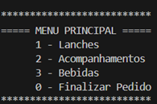
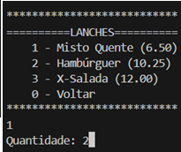
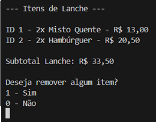
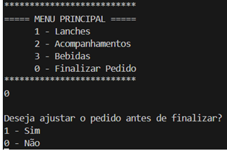
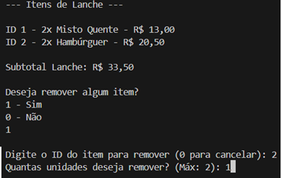
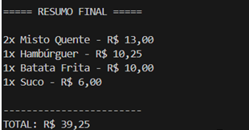

# 🍔 Versão 2 - Sistema de Cardápio em C#

## 📌 Descrição do Projeto
Este projeto teve início como uma aplicação desenvolvida em Portugol, utilizando Visualg, com o objetivo de aprender lógica de programação. Na versão 2, o sistema foi totalmente reestruturado em C#, com o uso da plataforma .NET e Programação Orientada a Objetos (POO).

---

## 🎯 Objetivo da Versão 2
O foco desta versão foi aprimorar a estrutura do código, tornando-o mais modular. Utilizamos classes para representar itens e pedidos, proporcionando uma navegação mais fluida e controle dinâmico do pedido, incluindo a possibilidade de edição e remoção de itens.

---

## 🛠️ Tecnologias Utilizadas
- Linguagem: C#  
- Plataforma: .NET  
- Estrutura: Programação Orientada a Objetos (POO)  
- Ambiente: Aplicação Console  

---

## 🚀 Funcionalidades
- Menu interativo com opções de lanches, acompanhamentos e bebidas  
- Adição de itens com quantidades definidas  
- Resumo detalhado do pedido por categoria  
- Edição e remoção de itens antes de finalizar o pedido  
- Cálculo automático de subtotais e total final  

---

## ▶️ Como Executar
1. Faça o clone do repositório  
2. Abra o projeto no Visual Studio ou outra IDE de sua preferência  
3. Compile e execute a aplicação no console  

---

## 🔮 Próximos Passos
- Adicionar persistência de dados (salvar o pedido)  
- Criar interface gráfica  
- Integrar o sistema com banco de dados ou API  

---

## 📈 Evolução do Projeto
Esta versão 2 representa uma evolução significativa do projeto original. A migração para C# e POO proporcionou mais organização, reutilização de código e flexibilidade para futuras expansões.

## 📸 Demonstração do Sistema

### 🧭 Menu Principal

### 🍔 Menu de Lanches

### 📊 Resumo de Lanches

### ⚙️ Ajuste de Pedido

### ⚙️ Remoção de Item

### 🧾 Resumo Final

---
Desenvolvido por Rúbia  
Estudante de Análise e Desenvolvimento de Sistemas
